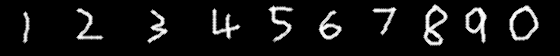

# Neural Network for number recognization

This uses the Pytorch module and the MNIST dataset.

## Features

<ul>
  <li>Allows users to test custom images</li>
  <li>Allows users to train the model on custom data</li>
  <li>Allows user to save and load models</li>
</ul>
